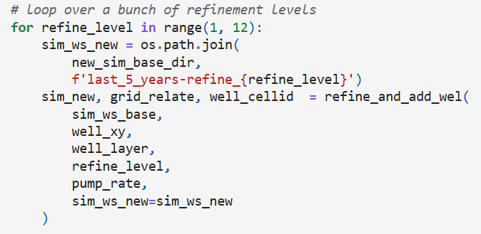
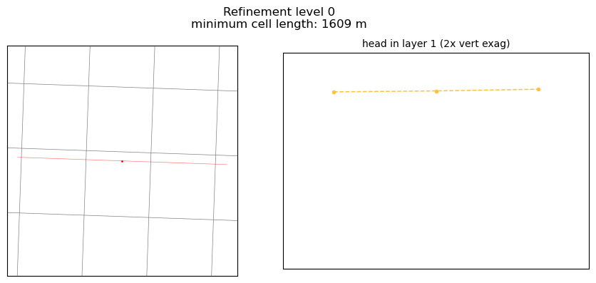
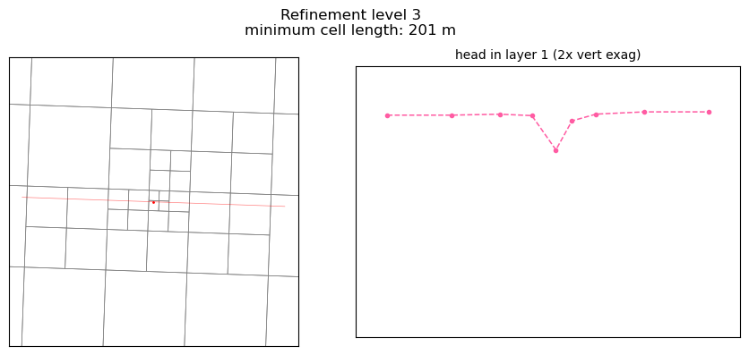
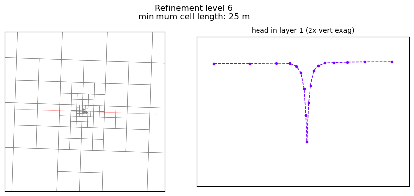

# mfmodify

## Description
`mfmodify` includes functions for reading and modifying existing MODFLOW 6 models.
This project has mostly been written in response to specific project needs, but
the tools may have more general application. 

Building model scenarios or editing the grid of a MODFLOW 6 model can be a substantial undertaking. This library aims to leverage the information from a model's history-matching period - reusing MODFLOW input files as much as possible.
**This library is in alpha stage of development. It has only been tested on two MODFLOW models so far.**

### Modules
- **scenario**: 
    - Quickly build scenarios for existing MODFLOW models with transient historic periods. 
    - Extract and reassemble stress period data for specified years into a new transient period.
    - Create synthetic years using weighted averages of years.
    - Tools for weighted sampling to adjust the likelihood of wet, dry, or average years.
  
- **regrid**: 
    - Convert a structured grid model to an unstructured grid model with local refinement.

- **utils**:
    - Utility functions used by scenario and regrid functions.

- **plotting**:
    - Plotting functions. Primarily for comparing models before and after functions from scenario or regrid modules have been applied.

'mfmodify' makes use of the flopy library but does not extend it's
functionality. I have decided I'm not a good enough programmer to create
my own classes, so this library does not contain any.

## Examples
See the notebooks in the examples directory to see the intended use of mfmodify.

Snippet from examples/regrid_example-compare_drawdown_at_different_refinements.ipynb:

